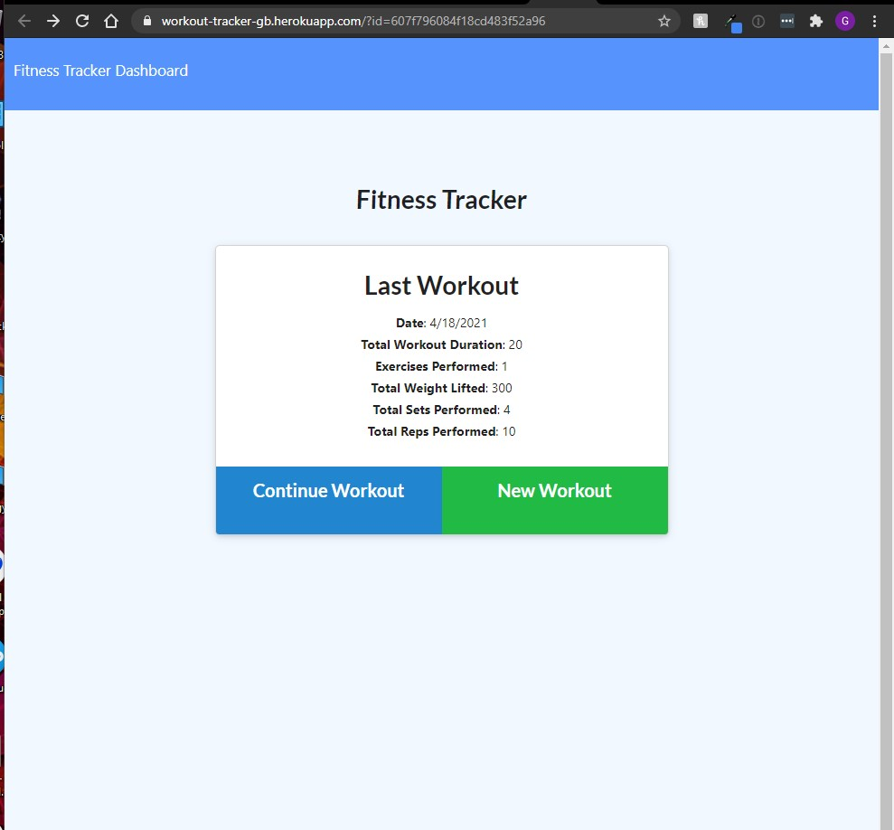

# WorkoutTracker
A workout tracker

## Description 
  
As a user, I want to be able to view create and track daily workouts. I want to be able to log multiple exercises in a workout on a given day. I should also be able to track the name, type, weight, sets, reps, and duration of exercise. If the exercise is a cardio exercise, I should be able to track my distance traveled.

## Table of Contents
* [Installation](#installation)
* [Usage](#usage)
* [License](#license)
* [Questions](#questions)

## Installation

*Steps required to install project and how to get the development environment running:*

1. Download or clone repository
2. Node.js & Mongodb is required to run the application
3. `npm install` to install the required npm packages
4. `npm run seed` to run seed data

## Usage

* To start using the application, open your browser and go to
  
  `http://localhost:3000/`

* A live demo is available on the link below:
    * [Live Heroku App](https://workout-tracker-gb.herokuapp.com/)

* Screenshot of the Application:

## License

MIT License

---

## Questions

* Please submit any questions at my [GitHub profile](https://github.com/grider27)

* Also, you can reach me via email @ grider27@gmail.com